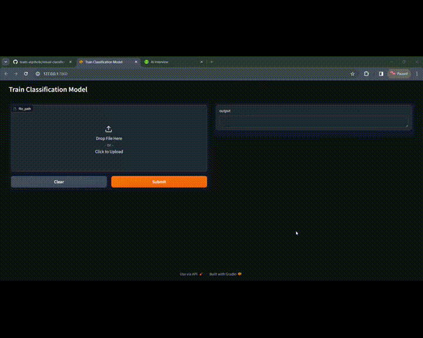

# Visual Classifier

This is a sample classification tool designed for internal document classification tasks. It has been customized to meet our specific requirements.



## Table of Contents

- [Features](#features)
- [Getting Started](#getting-started)
- [Usage](#usage)
- [Credits](#credits)

## Features

- **Classification:** This tool is designed to classify internal documents based on specific criteria.
- **User-Friendly Interface:** The frontend provides a user-friendly interface for easy interaction.
- **Backend Support:** The backend is simple but robust, depends on your VM capabilities.

## Getting Started

To get started with the Visual Classifier, follow these steps:

1. **Clone the Repository:**

   ```bash
   git clone https://github.com/team-algoholic/visual-classifier.git
   cd visual-classifier
   ```

2. **Install Dependencies:**

   ```bash
   python3 -m venv env
   # Create and activate virtual environment
   source ./env/bin/activate
   # Assuming you have Python and pip installed
   pip install -r requirements.txt

   ```

3. **Run the Application:**
   ```bash
   # Assuming your main file is app.py
   python3 training.py
   ```

## Usage

1. Open the application in your web browser at http://127.0.0.1:7860/
2. Upload the document you want to classify.
3. Follow the on-screen instructions to complete the classification.

## Credits

This project is maintained by the following contributors:

- [Kundan Kumar](https://www.linkedin.com/in/kundan-kumar-a54461202/): Responsible for Frontend development and Gradio Integration.
- [Harshit Verma](https://www.linkedin.com/in/harshit-verma-3a27b7287/): Responsible for ML Classifier development.
- [Sourabh Sinha](https://www.linkedin.com/in/nofoobar/): Responsible for Integration.

Feel free to reach out to the contributors for any questions or feedback.
